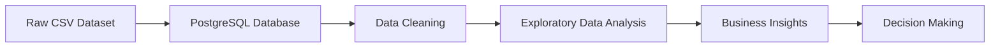

# 🛒 Zepto E-commerce SQL Data Analyst Portfolio Project

## 📌 Project Overview
<p align="center">
  
</p>

<h1 align="center">🛒 Zepto E-Commerce SQL Data Analyst Portfolio Project</h1>

<p align="center">
  
  
  
  
</p>

<p align="center">
📊 Real-World SQL Portfolio Project | 🚀 Data Analyst Portfolio | 📈 Business Intelligence
</p>

---

# 📌 Project Overview

This project demonstrates my SQL and Data Analytics skills through the analysis of a real-world e-commerce inventory dataset from Zepto, one of India's leading quick-commerce platforms.

The project simulates the responsibilities of a Data Analyst by performing:

* Database design and setup
* Data cleaning and preprocessing
* Exploratory Data Analysis (EDA)
* Business-focused SQL analysis
* Insight generation for decision-making

This project helped me strengthen my understanding of SQL, PostgreSQL, data cleaning techniques, and analytical thinking required in real-world business environments.

---

# 🎯 Objectives

Using SQL, I analyzed Zepto's inventory data to:

* Explore product categories and inventory availability
* Identify pricing inconsistencies and discount patterns
* Clean and transform raw business data
* Generate actionable business insights
* Practice real-world analytical workflows

---

# 🔄 Project Workflow



---

# 🛠️ Technologies Used

* PostgreSQL
* pgAdmin
* SQL
* CSV Data Processing
* Data Cleaning
* Exploratory Data Analysis
* Git & GitHub

---

# 📂 Dataset Information

The dataset contains product inventory information collected from Zepto's catalog.

## Key Columns

| Column                 | Description               |
| ---------------------- | ------------------------- |
| sku_id                 | Unique product identifier |
| name                   | Product name              |
| category               | Product category          |
| mrp                    | Maximum Retail Price (₹)  |
| discountpercent        | Discount percentage       |
| discountedsellingprice | Final Selling Price (₹)   |
| availablequantity      | Available Inventory Units |
| weightingms            | Product Weight            |
| outofstock             | Stock Availability Flag   |
| quantity               | Package Quantity          |

---

# 🏗️ Database Schema

```sql
CREATE TABLE zepto (
    sku_id SERIAL PRIMARY KEY,
    category VARCHAR(120),
    name VARCHAR(150) NOT NULL,
    mrp NUMERIC(8,2),
    discountPercent NUMERIC(5,2),
    availableQuantity INTEGER,
    discountedSellingPrice NUMERIC(8,2),
    weightInGms INTEGER,
    outOfStock BOOLEAN,
    quantity INTEGER
);
```

---

# 🔍 Exploratory Data Analysis

Performed the following analyses:

✅ Total products available in inventory

✅ Distinct product categories

✅ In-stock vs out-of-stock products

✅ Duplicate product listings across multiple SKUs

✅ Null value identification

✅ Product distribution across categories

---

# 🧹 Data Cleaning

Implemented several data quality improvements:

* Removed invalid records with zero pricing
* Handled missing values
* Converted monetary values into readable currency format
* Standardized inventory-related fields
* Verified data consistency before analysis

---

# 📊 Business Insights Generated

## 1. Top Discounted Products

Identified products offering the highest discounts.

## 2. Out-of-Stock Premium Products

Found expensive products currently unavailable.

## 3. Revenue Opportunity Analysis

Estimated potential revenue by category.

## 4. Low Discount Premium Products

Highlighted high-value products receiving minimal discounts.

## 5. Category Discount Ranking

Ranked categories by average discount percentage.

## 6. Price-per-Gram Analysis

Determined the best value-for-money products.

## 7. Product Weight Segmentation

Classified products into:

* Low Weight
* Medium Weight
* Bulk Weight

## 8. Inventory Weight Analysis

Calculated total inventory weight across categories.

---

# 📈 Sample SQL Queries

## Top 10 Highest Discounted Products

```sql
SELECT name,
       mrp,
       discountPercent
FROM zepto
ORDER BY discountPercent DESC
LIMIT 10;
```

## Category-wise Revenue Potential

```sql
SELECT category,
       SUM(discountedSellingPrice * availableQuantity) AS potential_revenue
FROM zepto
GROUP BY category
ORDER BY potential_revenue DESC;
```

## Premium Products Out of Stock

```sql
SELECT name,
       mrp
FROM zepto
WHERE outOfStock = TRUE
ORDER BY mrp DESC;
```

---

# 📈 Key Skills Demonstrated

* SQL Query Writing
* PostgreSQL
* Data Cleaning
* Data Validation
* Aggregations & Grouping
* Business Analytics
* Inventory Analysis
* Reporting & Insight Generation
* Problem Solving

---

# 🚧 Challenges Faced

### Numeric Field Overflow Error

While importing the dataset into PostgreSQL, the following error occurred:

```text
ERROR: numeric field overflow
A field with precision 5, scale 2 must round to an absolute value less than 10^3
```

### Solution

Updated numeric column precision:

```sql
discountedSellingPrice NUMERIC(8,2)
```

### UTF-8 Encoding Issue

Resolved CSV import errors by saving the dataset in UTF-8 CSV format before loading into PostgreSQL.

---

# 🚀 Project Outcomes

Through this project, I gained practical experience in solving real-world business problems using SQL and developed a stronger understanding of how data analysts support decision-making in e-commerce organizations.

---

# 📸 Project Screenshots

Add screenshots here:

* Database Schema
* Data Import
* SQL Queries
* Query Results
* Insights Dashboard

Example:

```markdown


```

---

# 👨‍💻 About Me

## Vivek Goyal

🎓 B.Tech Computer Science Engineering (2026)

Interested in:

* Data Analytics
* SQL Development
* Business Intelligence
* Data Engineering

Currently building hands-on projects to strengthen my analytical and problem-solving skills while preparing for Data Analyst and Business Analyst roles.

---

# 📫 Connect With Me

* GitHub: https://github.com/goyalvivek1500
* Email: [vivekgoyal1500@gmail.com](mailto:vivekgoyal1500@gmail.com)

---

# ⭐ Support

If you found this project helpful, consider giving it a star ⭐ on GitHub.

It motivates me to build and share more data analytics projects.
